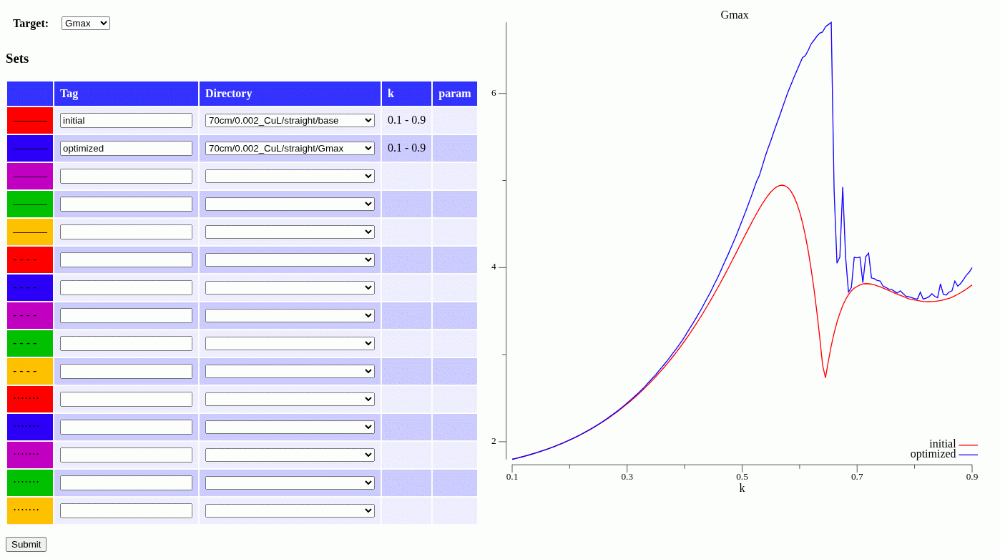
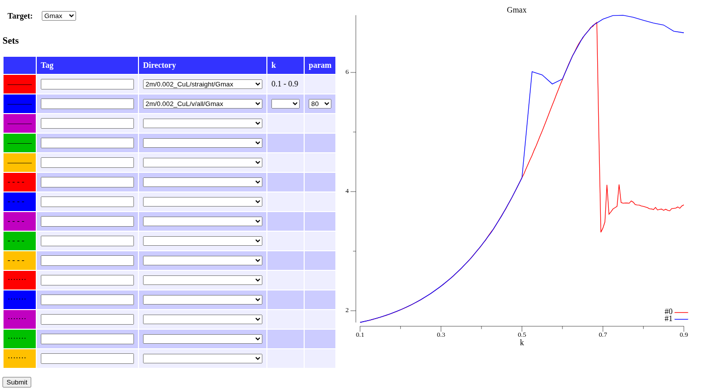
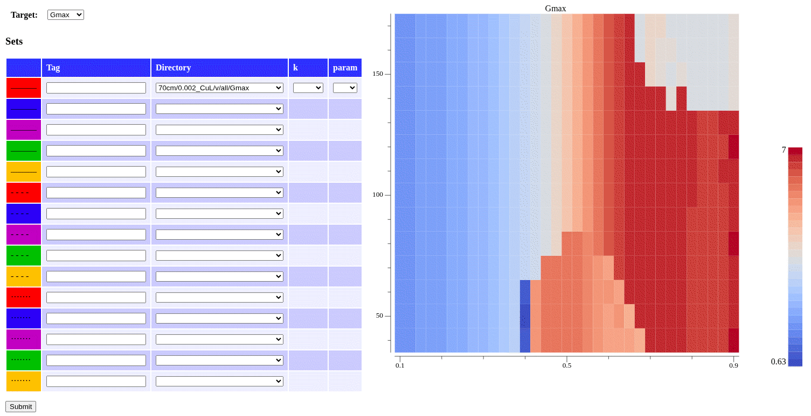

# Plotting

***Beware***: Plotting can only work if all computed models have been
[imported into the database](database.md).

The plot server is serving HTML at the specified listen address (default:
`localhost:12345`). Enter the address on the address bar of your browser
and you will see the plot page.

On the right side of the page is the plot canvas. On first start the canvas
is empty (except for the message "No plot available." as this part of the page
will also displays warnings and error messages).

On the top left side you can select a `Target` that will be plotted in the
graphs. There is a pre-defined list of targets to select from.

Below is a [model set](model_sets.md) selection form; up to 15
model sets can be selected. Each selection shows the linestyle and tag of
the corresponding graph in the plot on the left.

Model sets have dimensions; if you want to plot multiple model sets in one
plot, all sets must have the same dimension (typically leg length `k`) -
otherwise a plot would be meaningless.

## All model sets are one-dimensional

Simply select up to 15 model sets by selecting the model set directory
abd setting their labels (tags) in the plot legend (optional). Press the
`Submit` button to generate the plot.

## Model sets are one- and two-dimensional

If you mix one- and two-dimensional model sets and submit for plotting,
you will see an error message in the plot window, telling the model
sets are incompatible.

You can *reduce* a two-dimensional model set to one dimension by selecting
a single `param` value from the drop-down list and submit again:

## Model sets are two-dimensional

* If you select only **one** two-dimensional model set, the plot will
  show a "heatmap" of the results:

  

  The *x-axis* is `k` and the *y-axis* is `param`.

* If you select **two or more** two-dimensional model sets, you need to collapse
  the `param` dimension by selecting a fixed value. The model sets can be the
  same with just different values for `param`;

  

  This will do a *XY plot* for two slices of the model set (different opening
  angles, 80° and 140° respectively).
